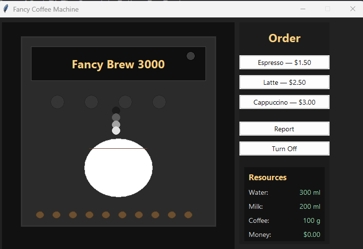

# Fancy Coffee Machine ☕

A sophisticated Python-based coffee machine simulator that combines strict resource management with a modern, animated Graphical User Interface.

## 🚀 Features

- **Animated GUI (Fancy Brew 3000):** - Real-time steam animations and cup-filling visuals.
  - Dynamic status bar and LED indicator.
  - Live resource tracking (Water, Milk, Coffee, and Profit).
- **Core Logic:**
  - **Resource Validation:** Checks if enough ingredients exist before starting an order.
  - **Coin Processing:** Handles Quarters, Dimes, Nickels, and Pennies.
  - **Transaction Management:** Calculates change and manages machine profit.
- **Maintenance Mode:** Generate reports to check current resource levels or safely turn off the machine.

## 📸 Interface Preview



## 🛠️ Project Structure

- `solution.py`: The core logic engine containing the `CoffeeMachine` class.
- `Display.py`: The Tkinter-based GUI implementation with custom animations.
- `main.py`: The terminal-based entry point for classic console play.
- `Coffee+Machine+Program+Requirements.pdf`: The official logic and business requirements for the build.

## 📥 Installation & Usage

1. **Clone the repository:**
   ```bash
   git clone [https://github.com/YOUR_USERNAME/fancy-coffee-machine.git](https://github.com/YOUR_USERNAME/fancy-coffee-machine.git)
   cd fancy-coffee-machine


   
Gemini said
Building on your previous project, this Fancy Coffee Machine is a great addition to your portfolio. It demonstrates your ability to take a set of business requirements  and translate them into a functional application with a professional Graphical User Interface (GUI).

Here is the complete documentation set, with the image references fixed to match your filenames.

1. GitHub Project Summary
Use this for the "About" section on your GitHub repository page.

A feature-rich Python Coffee Machine simulator featuring a custom Tkinter GUI with real-time animations. Implements resource management, coin processing, and transaction logic based on industry-standard requirements. Includes a classic terminal mode and a "Fancy Brew 3000" visual interface with steam effects and cup-filling animations.

2. Project Description
Use this for your portfolio website.

The Fancy Coffee Machine is a comprehensive Python application that simulates a professional beverage dispenser. The project is built to handle complex state management—tracking ingredients like water, milk, and coffee while managing financial transactions.
+1

Key highlights include:


Logic Engine: A robust CoffeeMachine class that validates resource availability and processes multi-denomination currency.
+1

Advanced GUI: A high-fidelity interface built with tkinter that features a status LED, dynamic resource bars, and a custom-drawn steam animation.

Dynamic UI Feedback: The application uses a custom filling animation that changes color based on the selected drink (Espresso vs. Latte).

3. README.md
Copy this into your README.md file. I have used your specific filename coffee machine UI.png for the image link.

Markdown
# Fancy Coffee Machine ☕

A sophisticated Python-based coffee machine simulator that combines strict resource management with a modern, animated Graphical User Interface.

## 🚀 Features

- **Animated GUI (Fancy Brew 3000):** - Real-time steam animations and cup-filling visuals.
  - Dynamic status bar and LED indicator.
  - Live resource tracking (Water, Milk, Coffee, and Profit).
- **Core Logic:**
  - **Resource Validation:** Checks if enough ingredients exist before starting an order.
  - **Coin Processing:** Handles Quarters, Dimes, Nickels, and Pennies.
  - **Transaction Management:** Calculates change and manages machine profit.
- **Maintenance Mode:** Generate reports to check current resource levels or safely turn off the machine.

## 📸 Interface Preview


## 🛠️ Project Structure

- `solution.py`: The core logic engine containing the `CoffeeMachine` class.
- `Display.py`: The Tkinter-based GUI implementation with custom animations.
- `main.py`: The terminal-based entry point for classic console play.
- `Coffee+Machine+Program+Requirements.pdf`: The official logic and business requirements for the build.

## 📥 Installation & Usage

1. **Clone the repository:**
   ```bash
   git clone [https://github.com/YOUR_USERNAME/fancy-coffee-machine.git](https://github.com/YOUR_USERNAME/fancy-coffee-machine.git)
   cd fancy-coffee-machine

🎮 How it Works
Select a Drink: Choose between Espresso, Latte, or Cappuccino.

Insert Coins: A dialog will appear for you to input the number of coins.

Enjoy: Watch the "Fancy Brew 3000" animate your drink preparation!

Maintenance: Use the Report button to see remaining ingredients or Turn Off to end the session.

📜 Requirements
Python 3.x

Tkinter (standard with most Python installations)


